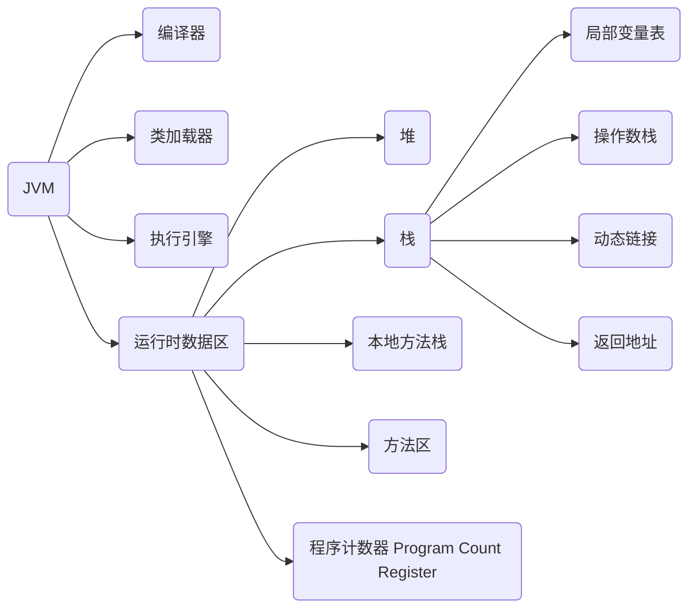

# JVM 底层探秘笔记


## JVM 速记


### 什么是 JVM?

>  JVM 就是由编译器, 类加载器, 执行引擎, 运行时数据区组成. 其中数据区包含 堆,栈,本地方法栈, 方法区和程序计数器(PC 寄存器), 其中栈是由局部变量表, 操作数栈, 动态链接, 返回地址组成的.

### 你是怎么对 jvm 垃圾回收进行优化的?

> 根据服务器的配置, 调整青年代和老年代的内存大小及比例, 在回收频率和回收速度上做取舍, 使用 G1 垃圾回收期控制 STW 停顿时间, 提高吞吐量.


### JVM 内存模型

> 每个线程有自己的内存区域, 多线程之间通信主要通过共享内存来实现.

- 有序性: 在 CPU 执行指令时, 可能会对非 happens-before 指令进行重排, 优化执行效率. 在单线程情况, 往往不会产生问题, 但涉及多线程时, 可能导致 bug.
- 可见性: 一个线程修改了一个共享变量, 另一个线程不会知道这个改变, 这就是不可见, 要确保可见性, 一般使用 volatile 关键词, 当然, 加锁也可以.
- 原子性: 即对于某代码, 实际执行时会分为好几个原子指令, 确保原子性必须加锁 (如synchronized) 处理

```
happens-before:
读后写
写后写
锁后解锁
可传递性
```

### 多线程

> 线程是一个进程中的不同执行路径, 一个进程至少有一个主线程.
>
> 进程是一个程序的抽象, 一个程序运行后一般为一个进程.

线程状态:

```
1.New (新建)
2.Runnable (就绪)
3.Running (运行中)
4.Blocked (阻塞)
5.WAITING (等待)
6.TIMED_WAITING (超时等待)
7.Dead (死亡)

[t:thread对象, obj: 同步块中的对象]
New: new Thread()
Runnable: t.start(), t.yield()
Running: after t.start() and cpu run it
Blocked: when enter synchronized block
WAITING: obj.wait(), t.join(), LockSupport.park()
TIMED_WAITING: Thread.sleep(x), obj.wait(x), t.join(x)
Dead: when t.run() is over
```


### JVM 对象结构

- **对象头**: 存储对象运行时数据和类型指针
  - **Mark Word**: 运行时数据
    - 标志位为01-未锁定: 对象 hash 码, 对象分代年龄
    - 标志位为00-轻量级锁定: 指向锁记录的指针
    - 标志位为10-重量级锁定: 执行重量级锁的指针
    - 标志位为11-GC标记: 空, 不需要记录信息
    - 标志位为01-可偏向: 偏向线程ID、偏向时间戳、对象分代年龄
  - **类型指针**： 指向对象的类的元数据的指针
  - **[数组长度]**： 若对象时数组，则会保存数组长度
- **实例数据**： 保存字段内容，包括父级
- **对齐**： 确保 8 字节，凑整


### 垃圾回收

#### 标记算法

1. **引用计数法**: 通过计算对象的引用数来判断对象是否可回收. 缺点是无法处理循环引用的问题.
2. **可达性分析算法**: 从根对象(两个栈引用的对象、静态属性引用的对象、常量引用的对象)出发, 寻找所有引用的对象, 形成根对象的引用链, 判断对象是否与根对象的引用链相关联来决定对象是否可回收.

#### 回收算法

1. **标记-清除算法**：标记后直接清除, 效率低, 产生内存碎片
2. **标记-复制算法**：需要两个大小相同的内存区域, 其中一块保持空闲, 先标记可用对象, 然后将可用对象复制到空闲区域, 再清空整块内存, 使其满足一块保持空闲, 如此循环即可.
3. **标记-整理算法**：标记后移动内存, 令内存使用的区域与未使用的区域均无碎片, 缺点是效率低, 有的是空间占用少.
4. **分代算法**：将堆分为新生代与老年代，根据自个区域的特定采用不同的回收算法. 新生代又分为 Eden 区(复制算法)、 Survivor 区(因使用复制算法, 分为 From、To 两块内存区域).

#### 回收器

> (前 3 个 Young GC 使用, 后面的 Full GC 使用)

1. **Serial** ：单线程，使用复制算法，整个过程一直 STW
2. **ParNew** ：多线程，使用复制算法，还是一直 STW
3. **Parallel Scavenge** ：多线程，使用复制算法，与 ParNew 不同之处在于其关注吞吐量，并可通过调节参数对吞吐量进行控制
4. **Serial Old**：单线程，使用标记-整理算法，老年代使用
5. **Parallel Old** ：多线程，使用标记-整理算法，与**Parallel Scavenge**一样，关注吞吐量。
6. **CMS** ：多线程，使用标记-清除算法，其步骤为：初始标记(STW)-并发标记-重新标记(STW)-清除，具有低停顿的性质，缺点是占用CPU资源严重，且产生内存碎片，整理内存碎片依旧会STW
7. **G1** ：多线程，与CMS类似，使用标记-整理算法，步骤为：初始标记(STW)-并发标记-最终标记(STW)-筛选清除(可控制停顿时间)，其优点是引入 Region 概念，优先清理垃圾更多的 Region

#### 对象分配策略

- 对象优先在 Eden 去分配
- 大对象直接进入老年代
- 长期存活的对象将进入老年代，可配置多少岁进入（默认15岁），熬过一次 Minor GC 涨一岁
- 动态对象年龄判定， Survivor 区空间中相同年龄所有对象大小的总和大于空间的一半，则年龄大于或等于该年龄的对象直接进入老年代；
- 空间分配担保，即防止新生代的对象大量存活时，Survivor 区装不下，则需要判定老年代是否还有足够大的连续空间（大于新生代Eden区或开启参数则取历代存活平均值），若有则可无需 FullGC，反之需要FullGC


## JVM 详记


### 组成图



### 概念

**JVM**: 

- **编译器**：对 Java 代码做优化，并将代码中结构、数据、实际代码编译成字节码。
- **类加载器**：
  - **类加载过程**: 加载（把字节码二进制流加载到方法区，如文件到内存）、验证（文件格式、元数据合法性、字节码指令等的校验）、准备（静态变量分配内存、初始化零值）、解析（字符符号引用解析成直接引用）、初始化（执行生成的 cinit 方法，里面是对静态变量的赋值指令和 static 块代码）
  - **new 对象过程**: 先进行类加载(若未加载), 接着为对象分配内存(内存大小是固定的), 接着讲内存空间的字段值初始化为零值(即内存中的值都是根据字段类型所对应的默认值), 对对象进行必要的设置(如与类信息绑定, 对象头的数据初始化等), 到此, 一个对象产生了, 然后再执行它的 init 方法(构造方法)就 ok 了.
- **执行引擎**：主要负责方法的分派，执行指令控制操作数栈。
- **运行时数据区**：
  - **堆**: 最大的内存区域, **线程共享**, 主要用于存放对象实例数据, 由于垃圾回收的原因, 也可分为新年代与老年代, 新年代具体可分为 Eden 区, From Survivor 区, To Surviovr 区.
  - **本地方法栈**: 与栈功能类似, 但服务于 Native 方法, 而Native 方法使用何种语言实现由具体虚拟机实现.
  - **方法区**: 用于存储加载的类信息、常量、静态变量等，**线程共享**.
  - **程序计数器 Program Count Register**: 一块较小的内存空间, **线程私有**. 存储线程所执行的字节码指令的行号, 分支、循环、跳转、异常处理、线程恢复等功能都需要依赖此内存. 当运行本地方法时, 值为空.
  - **栈**: 是Java方法执行的内存模型, **线程私有**, 生命周期与线程相同, 每个方法执行时会创建一个栈桢, 方法的调用和结束对应着栈桢的入栈和出栈. (总结: 栈像个集合, 存储着每个方法的栈桢)
    - (以下属于栈桢)
    - 局部变量表: 一组变量值存储空间，用于存放方法参数和方法内部定义的局部变量
    - 操作数栈: 是一个后入先出的栈，数据的写入与写出都由字节码指令控制，一开始是空的；这很像CPU的操作
    - 动态链接: 指向运行时常量池中该栈桢所属方法的引用，为了支持方法调用过程中的动态链接。
    - 方法出口(返回地址): 提供用于回到方法被调用的位置的地址，一般为进入前PC计数器中的值。


> 总结: 编译Java源代码, 创建内存并划分区域, 加载类字节码, 从入口开始执行指令, 本质上, 所有的执行都是方法直接的组合或嵌套而成, 因此最终所有的指令, 都在方法栈执行, 也就是操作数栈. 所以需要了解常用的指令, 如内存相关, 锁相关, 方法跳转, 指令间跳转(if/for).


### 指令（操作数栈）

- **字节码与数据类型**
  - i 开头代表对 int 类型的数据操作
  - l 开头代表对 long 类型的数据操作
  - s 开头代表对 short 类型的数据操作
  - b 开头代表对 byte 类型的数据操作
  - c 开头代表对 char 类型的数据操作
  - f 开头代表对 float 类型的数据操作
  - d 开头代表对 double 类型的数据操作
  - a 开头代表对 reference 类型的数据操作
- **加载和存储指令**
  - 讲一个局部变量加载到操作栈: iload、iload_<n>  即 **load**
  - 将一个数值从操作数栈存储到局部变量表: istore、istore_<n> 即 store
  - 将一个常量加载到操作数栈: bipush、sipush、ldc
  - 扩充局部变量表的访问所以的指令： wide
- **运算指令**
  - 加法（iadd、ladd）、减法（isub、lsub）、乘法（imul、lmul）、除法（idiv、ldiv）、求余（irem、lrem）
  - 取反（ineg、lneg）、位移（ishl、ishr、iushr）、按位或（ior、lor）、按位与（iand、land）、按位异或（ixor、lxor）
  - 局部变量自增指令（iinc）
  - 比较指令（dcmpg、dcmpl、fcmpg、fcmpl）
- **类型转换指令**
  - 宽化不需要转换（隐式）
  - 宅化有 i2b、i2c、i2s、l2i、f2i、f2l、d2i、d2l、d2f
- **对象创建于访问指令**
  - 创建实例的指令：new
  - 创建数组的指令：newarray、anewarray、multianewarray
  - 访问类字段（static 字段）和实例字段的指令：getfield、putfield、getstatic、putstatic
  - 把一个数组元素度加载到操作数栈：baload、caload、saload；即 aload
  - 将一个操作数栈的值存储到数组元素中的指令：bastore、castore、sastore、即 astore
  - 取数组长度的指令:arraylength
  - 检查类实例类型的指令：instanceof、checkcast
- **操作数栈管理指令**
  - 将操作数栈的站定一个或两个元素出栈：pop、pop2
  - 复制栈顶一个或两个数值并将复制值或双份复制值重新压入栈顶：dup、dup2、dup_x1、dup2_x1
  - 将栈顶最顶端的两个值互换： swap
- **控制转移指令**
  - 条件分支：ifeq、iflt、ifle、ifne、ifgt、ifge、ifnull、ifnonnull、if_icmpeq...
  - 复合条件分支：tableswitch、lookupswitch
  - 无条件分支：goto、goto_w、jsr、jsr_w、ret
- **方法调用和返回指令**
  - invokevirtual 调用对象的实例方法，根据对象的实际类型进行分派
  - invokeinterface 调用接口方法，搜索实现了接口方法的对象，找出适合的方法调用
  - invokespecial 调用一些需要特殊处理的方法，包括实例初始化方法、私有方法、父类方法
  - invokestatic 调用静态方法 （static 方法）
  - invokedynamic 指令用于在运行时动态解析出调用点限定符所引用的方法
  - 返回指令 ireturn、lreturn、freturn、dreturn、areturn、return（ void 返回值时）
- **异常处理指令** athrow；其他异常由涉及的指令抛出；另外 catch 不是由字节码指令实现，而是采用异常表
- **同步指令**
  - monitorenter 以栈顶元素作为锁开始同步
  - monitorexit 推出同步


### 类文件结构

- **魔数** 0xCAFEBABE  和**主版本号**(判断兼容性)
- **常量池**
  - 文本字符串
  - 声明为 final 的常量值
  - 类和接口的全限定名
  - 字段的名称和描述符
  - 方法的名称和描述符
- **常量池类型**: 字符, 字段, 方法, 类名, 普通类型常量
  - 字符串 CONSTANT_Utf8_info: tag u1, length u2, bytes, u1[]
  - Integer, Float, Double,String
  - 类 CONSTANT_Class_info: tag u1, index u2 (指向字符串)
  - CONSTANT_Name-AndType_info: tag u1, index u2, index u2
  - 字段 CONSTANT_Fieldref_info: tag u1, index u2(指向 CONSTANT_Class_info), index u2(指向CONSTANT_Name-AndType_info)
  - 字段 CONSTANT_Methodref_info: tag u1, index u2(指向 CONSTANT_Class_info), index u2(指向CONSTANT_Name-AndType_info)
- **访问标识**: 两个字节, 标识类还是接口, 是否 public, 是否 final, 是否 abstract, 是否注解, 枚举...
- **类索引、父类索引、接口索引集合** ：都是 CONSTANT_Class_info，其实就是全限定名
- **字段表集合**： 由多个字段表组成，下面为字段表的构成
  - access_flags 字段修饰符： 描述字段是否 public ，是否 private，是否 protected 等等
  - name_index 字段的简单名称
  - descriptor_index 字段的数据类型, 如 B（byte）、C（char）、D（double）、F（float）、L（对象类型）、[L（对象数组类型）
  - attribute_info 字段的额外信息, 如字段为常量时会含有额外信息
- **方法表集合**：有多个方法表组成， 下面为方法表的构成
  - access_flags 方法修饰符：修饰方法是否为 public、是否为 private、是否为 static、是否 synchronized 等等
  - name_index 方法的简单名称
  - descriptor_index 方法的参数类型和返回值类型, 先参数，后返回值，且参数被括号包围，如 ()V、(LLDF)L
  - attribute_info 方法的额外信息, 里面有名为 Code 的属性, 存放方法代码编译成的字节码指令
- **属性表集合**：类、字段和方法的额外信息存放处，类型有
  - 方法表的 Code：
  - 字段表的 ConstantValue
  - 方法表的异常信息 Exceptions
  - 类中的内部类 InnerClasses
  - 源码行号与字节码行号的对应关系 LineNumberTable
  - 栈桢中局部变量表中变量与Java源码定义变量直接的关系 LocalVariableTable
  - 泛型的签名信息 Signature


### 类加载过程

- **加载**
  - 通过一个类的全限定名来获取定义此类的二进制字节流
  - 将这个字节流所代表的惊天存储结构转化为方法区的运行时数据结构
  - 在内存中生成一个代表这个类的 java.lang.Class 对象,作为方法区这个类的各种数据的访问入口
- **验证**
  - 文件格式验证（如魔数，版本号、常量的类型等等）会简单校验字节流，将字节流转为内存里的数据结构
  - 元数据验证（这个类是否有父类、继承的类是否合法、非抽象类是否实现了所有抽象方法等等）
  - 字节码验证（校验方法代码中的字节码指令语义是否正确、保证方法的类型转换时有效的）
  - 符号引用验证（校验常量区的符号引用是否正确，确保解析阶段能正常执行）
- **准备**
  - 为静态变量分配内存，并初始化为零值
- **解析**
  - 类或接口的解析：解析的符号引用的类不是数组则需要先加载这个类，再校验访问权限
  - 字段解析：先从自身找，自身无且实现了接口，则找继承的接口中的引用，自身无也无实现接口，则找父类，都找不到则报错，找到则校验权限。
  - 方法解析：与字段类似，从自身到实现的接口、继承的父类中找，找到后校验权限。
  - 接口方法解析：从自身接口中或父接口中找、找到无需校验权限（都是 public）
- **初始化**
  - 执行 cinit 方法，方法中执行对静态变量的赋值指令和 static 快
  - 父类的初始化方法一定先于子类执行
  - 执行时会加锁同步执行、因此不要进行耗时操作


> 顺带一提类加载器，作用是加载字节码二进制流到虚拟机中，除了系统顶级的类加载器（用于加载 rt.jar）是由 C++ 实现外，其他的类加载器都是 Java代码，通过组合一个类加载器（即父类加载器），实现双亲委派模型：即总是先通过父类加载类，除非父类加载失败；若自己实现一个类加载器，一般需要组合 ClassLoader.getSystemClassLoader()
>
> 系统的类加载器有:
>
> - 启动类加载器 Bootstrap ClassLoader 加载 JAVA_HOME/lib 下的类，如 rt.jar
> - 扩展类加载器 Extension ClassLoader 加载 JAVA_HOME/lib/ext 下的类
> - 应用程序类加载器 Application ClassLoader 加载 classpath 下的类


### Java 内存模型

主要是为了屏蔽调各种硬件和操作系统的内存访问差异，以实现 Java 程序在各种平台下都能达到一致的内存访问效果。可有效防止不同平台的并发访问因平台差异有所不同引发线程安全问题。

- **主内存与工作内存**：这里变量不包括线程私有的内存区域
  - 所有变量都存储主内存中
  - 每条线程有自己的工作内存
  - 线程的工作内存中保存了该线程使用到的变量的主内存副本拷贝
  - 线程对变量的所有操作（读取、赋值等）都必须在工作内存中进行，而不能直接读写主内存的变量。
  - 不同线程之间无法直接访问对方工作内存中的变量
  - 线程间变量值的传递均需要通过主内存来完成
  - 主内存类似于物理硬件中的内存，而工作内存优先存储于寄存器和高速缓存中（看 JVM 具体实现）
- **内存间交互操作**
  - lock：作用于主内存的变量，它把一个变量表示为一条线程独占的状态。
  - unlock：作用于主内存的变量，它把一个处于锁定状态的变量释放出来，释放后的变量才可以被其他线程锁定。
  - read：作用于主内存的变量，它把一个变量的值从主内存传输到线程的工作内存中，以便随后的 load 动作使用
  - load：作用于工作内存的变量，它把 read 操作从主内存中得到的变量值放入工作内存的变量副本中。
  - use：作用于工作内存的变量，它把工作内存中一个变量的值传递给执行引擎，每当虚拟机遇到一个需要使用变量的值的字节码指令都会执行这个操作。
  - assign：作用于工作内存的变量，它把一个从执行引擎接收到的值赋给工作内存的变量，每当虚拟机遇到一个需要给变量赋值的字节码指令时执行这个操作。
  - store：存储作用于工作内存的变量，它把工作内存中一个变量的值传递给主内存中，以便随后的 write 操作使用
  - write：作用于主内存的变量，它把 store 操作从工作内存中得到的变量的值放入主内存中的变量中。
- **对于 volatile 型变量的特殊规则**
  - 保证此变量对所有线程的可见性，但不保证原子性，因此部分操作仍是线程不安全的， 如 i++
  - 禁用指令重排序优化， 即保证变量的赋值操作的顺序与代码中的顺序一致；其他变量可能会因指令重排序优化而不一致。
- **对于 long 和 double 型变量的特殊规则**
  - 对于这两类型变量， JVM 规范不严格要求对 8个操作（read、load等）都具有原子性
  - 但大多数虚拟机实现仍保证了这一点，所有不需要把这类型的变量特别的添加 volatile 修饰
- **原子性、可见性、有序性**
  - **原子性**：有 Java 内存模型来直接保证原子性变量操作包括（read、load、assign、use、store、write），基本可以认为基本数据类型的访问读写是具有原子性的，可使用 synchronized 实现原子性
  - **可见性**：是指当一个线程修改了共享变量的值，其他线程能够立即得知这个修改。volatile、synchronized、final 可实现可见性
  - **有序性**：如果在本线程内观察，所有的操作都是有序的；如果在一个线程观察另一个线程，所有的操作都是无序的。可使用 volatile、synchronized 实现有序性
- **先行发生原则**
  - 程序次序规则：在一个线程中，按照程序代码顺序，书写在前的操作先行发生于书写在后的操作。
  - 管程锁定规则：一个 unlock 操作先行发生与后面对同一个锁的 lock 操作。
  - volatile 变量规则：对一个 volatile 变量的写操作先行发生于后面对这个变量的读操作。
  - 线程启动规则：Thread 对象的 start 方法先行发生于此线程的每一个动作
  - 线程终止规则：线程中所有操作都先行发生于对此线程的终止检测。
  - 线程中断规则：对线程 interrupt 方法的调用先行发生于被中断线程的代码检测到中断事件的发生。
  - 对象终结规则：一个对象的初始化完成先行发生于他的 finalize 方法的开始
  - 传递性：如果操作 A 先行发生于操作 B， 操作 B 先行发生于操作 C，那就可以得出操作 A 先行发生于操作 C 的结论。


### Java 线程安全

> 定义: 当多个线程访问一个对象时，如果不用考虑这些线程在运行时环境下的调度和交替执行，也不需要进行额外同步（就是调用者不需要额外同步，代码本身可使用同步），或者在调用方进行任何其他的协调操作，调用这个对象的行为都可以获得正确的结果，那这个对象时线程安全的。 
>
> 作者说：把“调用这个对象的行为” 限定为 “单词调用” ，也可称为线程安全。这是个弱化。

- **Java 语言中的线程安全**
  - **不可变**：不可变的对象一定是线程安全的；如 String
  - **绝对线程安全**：与定义等同，过于严格
  - **相对线程安全**：仅保证对这个对象单独的操作是线程安全的，如 Vector。
  - **线程兼容**：对象本身不安全，但通过操作前后加同步手段来保证操作线程安全。则称为线程兼容，如 ArrayList。
  - **线程对立**：即使使用同步手段，还是无法做到线程安全的代码。比如 System.setIn()
- **线程安全的实现方法**
  - **互斥同步**：即只被一个线程使用，如 synchronized 
  - **非阻塞同步**：一般指乐观锁，即先进行操作，若无其他线程争用共享数据，那操作就成功了；如果共享数据有争用，产生了冲突，那就采用其他的补偿措施（通常是重试）；依赖 CAS 原子操作，即系统底层支持
  - **无同步方案**：一般指 ThreadLocal，将变量控制在线程中，不与其他线程共享，则也是线程安全的。
- **锁优化**
  - **自旋锁与自适应锁**：自旋指线程在等待锁时不让出CPU资源，而是循环的重试来获取锁；自然，可以配置重试次数，可以配置是否开启。自适应指的是自旋的时间或者说次数，根据虚拟机统计的自旋获得锁的成功与否，来增长或缩短自旋的时间。
  - **锁消除**：即 JVM 判断某些代码的变量无需使用同步，因为这些变量不会被其他线程锁读写，如方法里是局部变量的 StringBuffer 对象的 append 方法。其使用 synchronized，但局部变量都是线程私有的，并不会被其他线程读写。
  - **锁粗化**：避免锁粒度太小导致频繁的互斥，带来额外的开销，虚拟机会对这种情况将锁的范围粗化。
  - **轻量级锁**：即当一个锁没有两条以上的线程争用的时候，通过 CAS 操作加锁和解锁，比重量级锁开销更少。若超过两个线程争用，则通过修改对象头标志位将锁升级为重量级锁，因为此时再使用 CAS 反而是一种消耗（这是因为 CAS 总是会失败）
  - **偏向锁**：即一个线程第一次通过 CAS 获得这个锁后，之后再获取将不再需要加锁（即使释放了锁也没关系），这是因为在第一次获取时会将对象头的标志改为偏向锁，并记录线程 ID（这个动作也是通过 CAS 进行的），这样以后只需要对比线程 ID，刷脸入场。


### 大致流程

1. 编译器编译 .java 后缀文件得到字节码文件 .class；
2. 类加载器加载字节码文件到运行时区域；
3. 执行器为类的方法创建栈桢，并结合操作数栈执行字节码指令，遇到方法调用的指令，则可能需要根据对象类型判断执行哪个具体的方法，然后执行对应的字节码指令。

