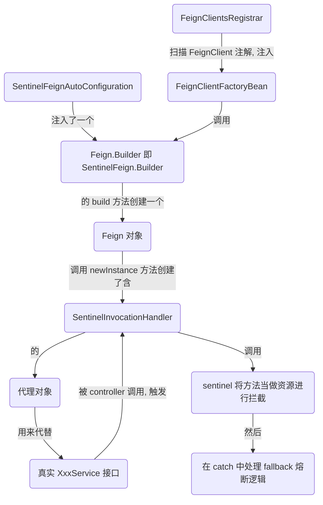

## Sentinel 与 Openfeign 整合


### 关键类

```bash
1.SentinelFeignAutoConfiguration
	注入了 Feign.Builder(即 SentinelFeign.Builder) 到容器中

2.SentinelFeign.Builder
	重写 build 方法注入 sentinel 的 InvocationHandler(SentinelInvocationHandler)

3.SentinelInvocationHandler
	拦截方法, 包装方法为一个资源, 进行流控降级等处理
	
4.SentinelAutoConfiguration
	注入了 SentinelResourceAspect 来支持 @SentinelResource 注解
	注入了 SentinelBeanPostProcessor 来处理 @SentinelRestTemplate
	注入了 SentinelDataSourceHandler 来加载各种数据源为规则配置

5.SentinelResourceAspect
	对加了 @SentinelResource 的方法添加 @Around 通知, 包围原方法已实现流控降级等处理.
	
6.SentinelBeanPostProcessor
	对加了 @SentinelRestTemplate 注解的 RestTemplate bean, 添加一个 SentinelProtectInterceptor

7.SentinelDataSourceHandler
	解析 spring.cloud.sentinel.datasource 的配置, 加载配置的规则到 Sentinel 中.
	
8.SentinelProtectInterceptor
	包装 RestTemplate 的请求, 使其可被流控降级等操作.
```


### 整合步骤

```bash
1.Feign 那边的步骤是, 先从容器中获取 Feign.Builder 对象, 并且 FeignContext 也会注入一个默认的 Builder 对象, 但是毕竟是子容器, 优先级没有父容器高(加载配置更后, 所以 @ConditionalOnMissingBean 触发, 子容器就不注册了). 因此我们在父容器中中配置一个 Builder 就能进行对接.
2.Feign 的实现是通过 JDK 生成一个代理对象拦截方法来构造并执行 HTTP 请求, 因此其需要一个 InvocationHandler 来拦截配置; 在 Feign 中, 通过字段 invocationHandlerFactory 来创建这个 InvocationHandler, 所以我们注入自己实现的 Builder 需要设置这个字段.
3.即 SentinelFeign.Builder.build() 中调用 super.invocationHandlerFactory(xxx) 来设置.
4.xxx 是匿名内部类, 直接看 create 方法, 这里根据 @FeignClient 注解的配置(fallback/fallbackFactory) 创建了一个 SentinelInvocationHandler
5.SentinelInvocationHandler.invoke() 的逻辑是使用 SphU.entry() 包围 feign 生成的 method(这个 method 是干正事的: 执行负载均衡和发送 Http 请求), 这就对这个 method 进行流量控制了; 然后还在 catch 中处理 fallback.
6.至此, 与 feign 的对接就完成了
```

> 总结: 新建一个 Builder 令生成的 Feign 对象持有我们指定的 invocationHandlerFactory, 使其创建代理对象时使用我们创建的 SentinelInvocationHandler 拦截对象方法; 这样就把方法的执行包围起来, 进行流量控制和熔断降级(catch 异常调用 fallback)了.





### 整合 FeignCircuitBreaker.Builder 步骤

> 即不注入自己的 Builder, 使用 openfeign 提供的 Builder, 通过扩展 CircuitBreakerFactory(即扩展 CircuitBreaker) 来实现流控降级(倒是 fallback 的处理便轻松了不少)


```bash
1.在 SentinelCircuitBreakerAutoConfiguration 注入一个 CircuitBreakerFactory.
2.在 Openfeign 中, 会调用其 create() 创建得到一个 CircuitBreaker (即 SentinelCircuitBreaker)
3.接着会在 FeignCircuitBreakerInvocationHandler.invoke() 中获取这个 CircuitBreaker, 调用其 run() 将要执行的 method 交给 SentinelCircuitBreaker 来处理.
4.SentinelCircuitBreaker 中 run() 的实现就是简单的 SphU.entry() 来包装方法为资源进行流控降级, 至于 fallback 则直接调用 apply 交由 Openfeign 处理.
```

> 总结: 不写自己的 Builder, 简单多了! 主要是去掉了 fallback 相关配置的获取与处理.