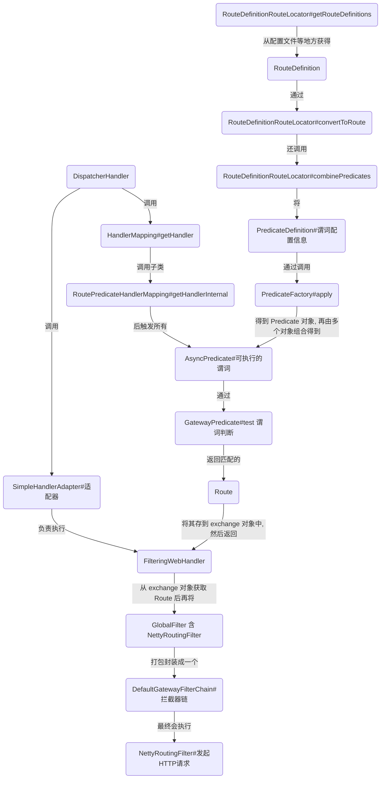

# Spring Gateway 源码笔记


## 关键类

```bash
1.DispatcherHandler
	Spring Webflux 的核心类, 负责协调 HandlerMapping 和 HandlerAdapter

2.HandlerMapping
	Spring Webflux 的核心类, 负责根据请求信息查找 handler

3.HandlerAdapter
	Spring Webflux 的核心类, 负责执行 handler
	
4.RoutePredicateHandlerMapping
	Spring Gateway 实现的 HandlerMapping, 负责根据谓词查找 Route 对象并返回 handler(FilteringWebHandler)

5.FilteringWebHandler
	是一个 handler
	用于获取 route 对象的信息(主要是 GatewayFilter), 然后封装所有拦截器(包括 GlobalFilter)到 DefaultGatewayFilterChain, 挨个执行, 倒叙回归.
	
6.RoutePredicateFactory
	谓词实现类的工厂类
	负责创建具体的谓词工厂(如 Path, Method, Before 等)
	apply() 返回一个 Predicate
	
7.Predicate
	定义了 test 方法, 返回 Boolean 值, true 代表匹配, false 代表不匹配(指匹配 Route)
	
8.GlobalFilter/GatewayFilter
	定义了一个拦截方法, 可拦截请求进行相应处理
	
9.AsyncPredicate/AndAsyncPredicate
	AsyncPredicate 本质上是一个方法(单方法接口), 方法被调用时会调用保存的 Predicate 类型字段的 test() 方法.
  AndAsyncPredicate 是一个左右结构的 AsyncPredicate, 进行判断时先判断左边, 再判断右边
  若不断的 and, 会形成树结构. 所以执行时类似遍历二叉树.

10.RouteDefinitionRouteLocator
	负责从不同的 Locator(如配置文件) 获取 RouteDefinition, 并负责将 RouteDefinition 转成 Route 对象
	
11.RouteDefinition
	包含有路由的所有配置信息, 含谓词, 拦截器, id, url 等等, 但都是字符串.
	
12.Route
	含有的配置信是转化好了的, 如 Predicate 和 GatewayFilter.
	
13.NettyRoutingFilter
	使用 netty 发送 http/wss 等请求.

14.GatewayFilterFactory
	拦截器实现类的工厂类
	负责创建具体的 GatewayFilter 对象.

15.AbstractConfigurable
	负责处理谓词的配置和拦截器的配置转化成不同的 Class 配置.
	实际上由 shortcutFieldOrder 属性配合 Binder 实现.
	即按 shortcutFieldOrder 配置的字段列表, 按顺序从 PropertySource 中读取数据进行绑定; 而 PropertySource 则是从 RouteDefinition 的配置信息加入到 Map 后再用 MapConfigurationPropertySource 包装 Map 而得到的.
```

> 总结: 除了谓词工厂和拦截器工厂这块的实现复杂, 其他都算比较简单, 哪怕响应式编程的代码到处都是, 也还是可以大致的理解代码的意思.
>
> 这两个工厂其实基本是同一套逻辑, 同一套代码, 就是有一个接口名不同, 然后其作用也不同, 但很相似.


## 谓语的实现原理(如何判断哪些请求该走哪个道)?

```bash
1.Spring gateway 基于 Spring webflux, 因此会执行 DispatcherHandler, 这是一个 WebHandler, 所以会调用 DispatcherHandler.handle(), 这个类通过 HandlerMapping 查找对应的 handler 来执行.
2.在初始化时会从容器中查找 HandlerMapping 类型的 bean, 用于查找 handler; 而 gateway 实现了一个 RoutePredicateHandlerMapping(GatewayAutoConfiguration 中注册进去的); 因此这里是入口!!!
3.再看 RoutePredicateHandlerMapping 的逻辑, 其通过继承抽象类, 因此会在 getHandlerInternal() 中获取 handler. 接着回顾下 Route 对象的获取.
4.其使用 RouteDefinitionRouteLocator 对象来调用 PropertiesRouteDefinitionLocator.getRouteDefinitions() 获取 RouteDefinition 集合对象(这里还有好几个不同的 Locator), 然后在 RouteDefinitionRouteLocator.convertToRoute() 中将 RouteDefinition 转成 Route 对象, 此时会调用 RouteDefinitionRouteLocator.combinePredicates() 将 RouteDefinition 中的 PredicateDefinition 集合信息转成了 AsyncPredicate 对象集合. 这个 AsyncPredicate 是通过解析谓词字符串, 根据谓词名称获取工厂类(PredicateFactory)再调用相应工厂类的方法(apply 方法)生成含相应逻辑判断的 GatewayPredicate 类(判断逻辑在 test 方法中); 顺带一提谓词配置信息是 从 apply 的参数中传递过来的.
5.Spring Gateway 默认注入了很多工厂(见 GatewayAutoConfiguration), 如 Host,Path,Method,Query,Cookie 等等.
6.这样 在 RoutePredicateHandlerMapping.lookupRoute() 中的 r.getPredicate().apply(exchange) 就会执行 Route 中的谓词判断, 仅保留匹配的 Route, 然后再剩下的 Route 中取第一个返回. 最后将 Route 对象存到 exchange 中, 然后返回 FilteringWebHandler. 
7.这是一个 WebHandler, 会由自带的适配器 SimpleHandlerAdapter 执行, 即调用其 handle 方法.
8.FilteringWebHandler 从 exchange 中取出 Route 对象, 在将 globalFilter 和 gatewayFilter 放到集合中(相当于链)再递归调用所有 Filter; 其中有几个 Filter 会执行请求, 即将请求分发到指定地址. 如 NettyRoutingFilter(见 GatewayAutoConfiguration).
9.到此以将 Spring gateway 接收到的请求根据谓语匹配对应的 Route(路由) 再执行所有的 Filter 后请求 route 配置的地址.

```

> 总结: 从 Spring webflux 的入口, 先 getHandler(), 得到的是返回值 FilteringWebHandler, 这个返回值会被 SimpleHandlerAdapter 执行, 但与谓词的逻辑无关; 但 getHandler() 还将配置文件(以及其他地方)获取到的 RouteDefinition 转成 Route 对象, 同时也将 RouteDefinition 中的 PredicateDefinition 转换成了 Predicate, 再将多个 Predicate 组成树结构变成一个 AsyncPredicate; 然后调用 AsyncPredicate 遍历执行每个谓词判断. 有一个返回 false, 则整个结果返回 false (指 and 相连). 如此便完成了根据谓词判断是否匹配 Route!!




## 与 LoadBalancer 对接步骤


```bash
1.上面讲到执行所有的 Filter, 那么除了用户配置的 GatewayFilter, Gateway 配置的全局 Filter 也会执行(见 GatewayAutoConfiguration); 而负责处理 lb:// 的 Filter 是 ReactiveLoadBalancerClientFilter (见 GatewayReactiveLoadBalancerClientAutoConfiguration) 
2.具体方法为 ReactiveLoadBalancerClientFilter.filter(), 其逻辑是取出 host, 调用 LoadBalancer 的 choose() 获取 ServiceInstance, 然后将 url put 回 exchange 的上下文中存起来即可.
```


## 拦截器的执行方式?

```java
// 拦截链是肯定的, 所有的 Filter 都可以先执行自己逻辑, 再使用 chain 触发下一个 Filter 直到无拦截器
// 然后开始返回, 因为是顺序进入, 所以是倒叙返回
// 返回后正常是一路不断往回返回, 但你的 Filter 也可以在 调用 chain 的时候不直接返回, 而是先暂存返回值, 再通过 exchange 对象(此时执行了其他 Filter 包括实际请求也执行了, 因此会有响应数据)取出响应数据(或返回值), 进行修改, 再 return 暂存的变量.
private static class DefaultGatewayFilterChain implements GatewayFilterChain {

  private final int index;

  private final List<GatewayFilter> filters;

  DefaultGatewayFilterChain(List<GatewayFilter> filters) {
    this.filters = filters;
    this.index = 0;
  }

  private DefaultGatewayFilterChain(DefaultGatewayFilterChain parent, int index) {
    this.filters = parent.getFilters();
    this.index = index;
  }

  public List<GatewayFilter> getFilters() {
    return filters;
  }

  @Override
  public Mono<Void> filter(ServerWebExchange exchange) {
    return Mono.defer(() -> {
      // 这里挨个取出, 虽然没有对 filters 进行 pop 操作啥的, 但是下一个执行完后, 会调用 chain.filter
      // 等于在递归进入这个方法, 虽然是不同对象的.. 但因为维护了 parent 和 index 的值
      // 使得 this.index < filters.size() 这个递归终止条件得以正确执行. 因此和递归是类似的.
      // 也就是说, 最后所有 filter 执行完后, 也会不断的回归.
      // 那么, 最后的 Filter 完成请求(比如 http 请求), 得到的 response 会存在 exchange 中
      // 这样回归过程(也就是 chain.filter 方法之后得代码就可以取得数据进行干预)
      if (this.index < filters.size()) {
        GatewayFilter filter = filters.get(this.index);
        DefaultGatewayFilterChain chain = new DefaultGatewayFilterChain(this, this.index + 1);
        return filter.filter(exchange, chain);
      }
      else {
        return Mono.empty(); // complete
      }
    });
  }

}
```

