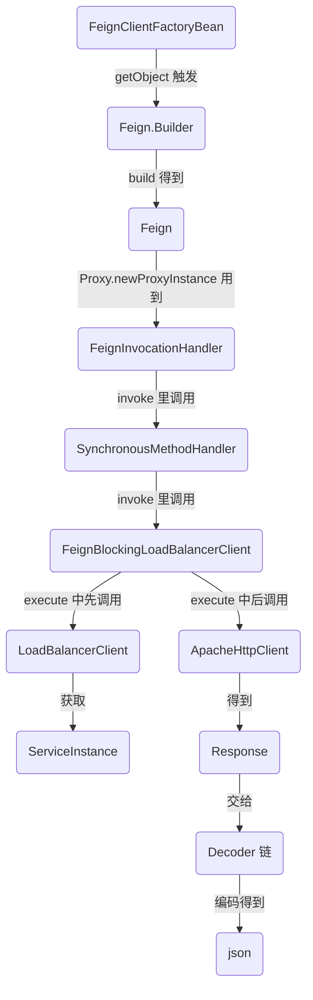

# Spring Cloud Openfeign 源码笔记


## 关键类分析

```bash
# 1.FeignAutoConfiguration
  配置了一个管理 feign 子容器的工厂(FeignContext). 
  配置一个 Targeter, 直接中专 fegin 的 target 方法(DefaultTargeter, 这里扩展可以实现降级哦)
  配置了一个 feign client (ApacheHttpClient), 用于执行 HTTP 请求
  还配备了 ok http client 方式的 feign client, 但默认不启用

# 2.FeignClientsRegistrar
  被 @EnableFeignClients 引入
  扫描带 @FeignClient 注解的接口, 生成代理对象(FeignClientFactoryBean)注册到容器中

# 3.FeignClientFactoryBean
  继承自 FactoryBean, Spring 的东西, getBean() 时调用跳转到 getObject()
  getObject() 会调用通过 feign 对象生成代理对象

# 4.FeignInvocationHandler
	JDK 动态代理生成对象的的方法拦截器
	通过调用 SynchronousMethodHandler 的 invoke() 实现发送请求的功能

# 5.SynchronousMethodHandler
	invoke() 会调用 FeignBlockingLoadBalancerClient 的 execute() 通过负载均衡获取 url 再调用 ApacheHttpClient 的 execute() 发送带实际 url 的 HTTP 请求.

# 6.ParseHandlersByName
	具有核心方法 apply, 解析 @FeignClient 接口的所有方法的注解和参数信息, 转化为 RequestTemplate, 可用于构造 HTTP 请求对象. 转化后的信息存于 SynchronousMethodHandler 字段中.

# 7.FeignBlockingLoadBalancerClient
	execute() 会调用 LoadBalancerClient 的 choose() 根据 serviceId(即 HTTP 的 host) 获取 url.
	还负责调用 ApacheHttpClient 的 execute() 真正的发送 HTTP 请求.

# 8.LoadBalancerClient
  commons 下 loadbalancer 项目的老伙计了... 干啥的来着? 忘了

# 9.ApacheHttpClient
	负责发送 HTTP 请求.
	

```


## openfeign 原理(@EnableFeignClients 生效步骤)


```bash
1.先解析 @EnableFeignClients 导入 FeignClientsRegistrar.class
2.FeignClientsRegistrar 将扫描带 @FeignClient 注解的接口, 注册到容器中
3.注册进容器的是一个 FeignClientFactoryBean
4.FeignClientFactoryBean 其本质是一个 FactoryBean, 会在被 getBean() 时调用 getObject()
5.getObject() 会从容器中取 Feign.Builder builder 对象再根据配置文件进行配置 
6.接着会走 Targeter 对象(默认为 DefaultTargeter)的 target(), 其默认为 builder.target(target); 其中 builder 为 Feign.Builder 对象, target 为 type(class), name(serviceId), url(http://name/path)
7.target() 会先调用 build()生成一个 feign 对象, 再调用 feign.newInstance(target) 生成一个代理对象
8.先看 build() 方法, 初始化了重要属性 targetToHandlersByName, 值为 new ParseHandlersByName(), 这个类的 apply() 会在过一会用到. apply() 逻辑是遍历挨个解析方法上的注解(如@RequestMapping, @RequestParam, @PathVariable等等)和参数, 转化后包装成 HTTP 请求相关的实体类, 存到 SynchronousMethodHandler 的字段中, 再返回 SynchronousMethodHandler 对象存到 map 里.
9.再看 feign.newInstance(), 先调用刚说的重要属性 targetToHandlersByName.apply(), 获得一个 map, 里面键大致为类名+方法名+形参组成, 值是 SynchronousMethodHandler 对象(见 SynchronousMethodHandler.Factory.create()), 然后遍历代理类的所有方法, 将方法所对应的 SynchronousMethodHandler 从 map 中取出再存到另一个 map, 这个 map 的键则为 method; 接着使用 JDK 动态代理生成一个代理对象, 其用于拦截方法的类 InvocationHandler 具体为 FeignInvocationHandler, 这个类里面的 invoke 逻辑很简单, 先排除 Object 通用的方法的影响, 对于正常方法会调用 SynchronousMethodHandler 的 invoke()... 闹了半天就是个中转呗, 有类的 Handler 到了方法的 MethodHandler.
10.SynchronousMethodHandler 的 invoke() 的核心代码是 this.client.execute(), 这里会走到 feign.Client 的具体实现类. 可能是 ApacheHttpClient(当 url 有地址时), 那就直接执行请求了, 也可能是 FeignBlockingLoadBalancerClient, 那么会调用 loadBalancerClient 的 choose 方法获取 url, 再执行 feignClient.execute(), 这次这个 feignClient 则肯定是 ApacheHttpClient 了, 于是最终就这样发送了请求.

#PS: 
有人问我(无中生友)发送的 HTTP 请求怎么构建? 
其实我上面说的很清楚了, 关键就在于 apply(), 好吧, 我说的具体一点... 关键在于 SpringMvcContract#parseAndValidateMetadata()
这个的入口在 apply() 的第一行, this.contract.parseAndValidateMetadata() 一直往里跳转, 就会进入 SpringMvcContract...  具体代码挺多的... 真的没必要细读... 因为其本身只相当于一个工具类, 而读源码应该放眼大局, 否则每段代码都认真读, 那太难了!!!

```

> 总结: 扫描 @FeignClient, 生成代理对象, 扔进容器. 拦截代理对象的方法, 调用方法对应的 SynchronousMethodHandler, 此类调用之前解析好的 RequestTemplate 生成请求对象, 再通过 Client 执行请求, 若配置了负载均衡, 则会调用 LoadBalancerClient 将 serviceId 先解析成具体的地址再转交给 ApacheHttpClient 执行请求.


## 代理对象的生成步骤





