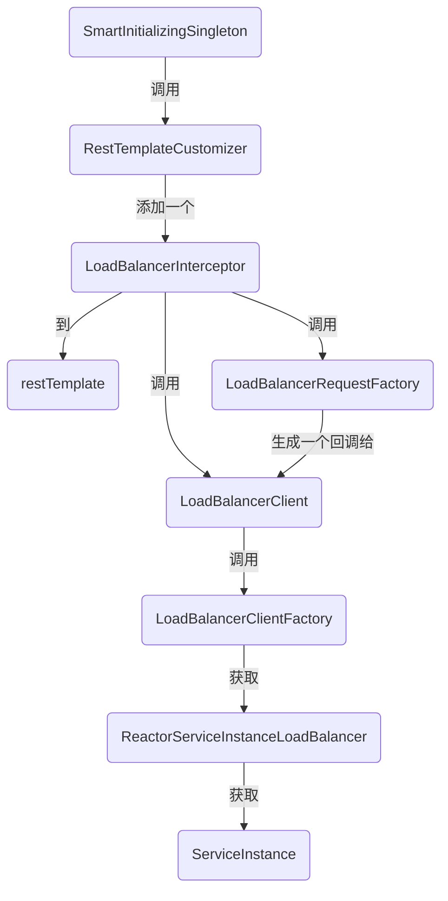

# Spring Cloud Commons 之 loadbalancer 源码笔记

> Spring Cloud Commons 是什么样的? 有什么作用? 如何与 Spring Cloud 和 Cloud Alibaba 整合?
> 让我们带着这些问题去研究源码吧! 


## loadbalancer 原理分析

```bash
# 先来认识一下 Spring Cloud Commons 吧
是定义了诸多接口(如ServiceRegistry/DiscoveryClient/LoadBalancerClient)和注解(如!EnableDiscoveryClient/@LoadBalanced)为主, 少量代码实现(如 RandomLoadBalancer). 
以及对 Spring 容器(Context) 的扩展(如 NamedContextFactory, bootstrap 配置文件的加载, 容器重启, 容器跟随配置文件刷新等等)
当然还有一些打包好的 starter.
我们要研究的 loadbalancer 就是其中一个子项目.

```


### loadbalancer 关键类解析

```bash
# 0.惊! 一堆类仅为添加一个拦截器
LoadBalancerRequestFactory: 一个工厂, 包装一个为请求对象 HttpRequest 加料的回调 LoadBalancerRequest

LoadBalancerClient: 用于根据 serviceId 选取一个 ServiceInstance, 执行从 LoadBalancerRequestFactory 获得的那个回调

LoadBalancerInterceptor: restTemplate 的拦截器, 拦截后调用 LoadBalancerClient 修改 HttpRequest 对象(主要是 url), 且传入调用 LoadBalancerRequestFactory 生成的回调给 LoadBalancerClient

RestTemplateCustomizer: 为 restTemplate 加上一个拦截器(也可以干点别的, 默认就这一个用处)

SmartInitializingSingleton: 调用 RestTemplateCustomizer 为容器中所有加了 @LoadBalanced 的 RestTemplate 加上一个拦截器

# 1.获取对象的工厂, 以 Spring 容器作为载体管理对象.
NamedContextFactory
	继承 DisposableBean, 用于类销毁是执行点东西(指创建的好多个子容器)
	继承 ApplicationContextAware, 用于将子容器和当前容器关联起来(所以 Spring 树形扩展这个设计真不错)
	泛型 C extends NamedContextFactory.Specification, 无它, 就是个 POJO, 存个 name 和对应的配置 class, 用于初始化容器的(会被注册进去, 然后解析里面的注解啥的...)
	此类作用就是管理一大堆(取决于你微服务拆分的程度)子容器, 获取其他代码需要的类型对象


ReactiveLoadBalancer.Factory
  定义了获取 ReactiveLoadBalancer 的接口以及与其相关的扩展
  

LoadBalancerClientFactory
  继承 NamedContextFactory, 构造参数指定了几个属性值
  实现了 ReactiveLoadBalancer.Factory 的接口, 即提供获取 ReactiveLoadBalancer 的方法.
  泛型具体为 LoadBalancerClientSpecification, 还是个POJO
  

# 2.包含算法逻辑的负载均衡策略的类
Response
	server 的封装类, 一般持有一个 ServiceInstance 对象, 如 DefaultResponse
	
Publisher
	响应式编程的东西, 可获取 Response<T> 对象, 一般为 Response<ServiceInstance>
	
ReactiveLoadBalancer.Factory
	定义了获取 ReactiveLoadBalancer 的接口以及与其相关的扩展

ReactiveLoadBalancer
	定义了 choose 方法, 即如何选取一个 ServiceInstance, 如轮播, 随机...

ReactorLoadBalancer
  定义了 choose 方法的另一形式, 仅返回值不同, 为 Mono<Response<T>> 是 Publisher<Response<T>> 的子类, 返回值为抽象类.

ReactorServiceInstanceLoadBalancer
  继承 ReactorLoadBalancer
	仅仅作为一个标记类, 无新接口
	
```


### 类大致调用图




> 瞅瞅有哪些负载均衡策略吧(看完发现这才是最简单的... 外面那些结构反而不容易理清)

```java
// 1.RandomLoadBalancer: 就是随机数呗, 0-size, 简单!!
// 在 RandomLoadBalancer#getInstanceResponse() 中
// 觉得这个方法可以做出 protected, 这样有些实现只需要重写这个方法就行了 
private Response<ServiceInstance> getInstanceResponse(List<ServiceInstance> instances) {
  if (instances.isEmpty()) {
    if (log.isWarnEnabled()) {
      log.warn("No servers available for service: " + serviceId);
    }
    return new EmptyResponse();
  }
  int index = ThreadLocalRandom.current().nextInt(instances.size());

  ServiceInstance instance = instances.get(index);

  return new DefaultResponse(instance);
}

// 2.RoundRobinLoadBalancer
// 在 RoundRobinLoadBalancer#getInstanceResponse() 中
// 用一个 position 保存位置, 这个主意高啊, 即保证了数据的正确性, 还.... 编不下去了!!
private Response<ServiceInstance> getInstanceResponse(List<ServiceInstance> instances) {
  if (instances.isEmpty()) {
    if (log.isWarnEnabled()) {
      log.warn("No servers available for service: " + serviceId);
    }
    return new EmptyResponse();
  }
  // TODO: enforce order?
  int pos = Math.abs(this.position.incrementAndGet());

  ServiceInstance instance = instances.get(pos % instances.size());

  return new DefaultResponse(instance);
}
```

> 这代码简单的, 特别不想分析.... 但其实最开始就是冲着这个来的... 总得看看吧, 咳咳!!


### loadbalancer 原理分析

1. 先拦截 RestTemplate 对象的请求, 使其调用 LoadBalancerClient 的接口获取真实IP

```bash
# org.springframework.cloud.client.loadbalancer.LoadBalancerAutoConfiguration 中
1.@Bean 加入一个 LoadBalancerRequestFactory, 并且带有用户自定义的 transformers(作用: 对选取真实 url 后的请求对象进行干预)
2.@Bean 加入一个 LoadBalancerClient, 其作用是, 根据 serviceId 获取/选取真实 url, 以及执行请求
3.@Bean 加入一个 LoadBalancerInterceptor, 即核心拦截器. 逻辑是: 获取 host, 调用 LoadBalancerRequestFactory 生成请求, 用 LoadBalancerClient 执行.
4.@Bean 加入一个 RestTemplateCustomizer, 其作用是: 为给定的 RestTemplate 添加一个 LoadBalancerInterceptor.
5.@Bean 加入一个 SmartInitializingSingleton, 作用是单例都加载后触发回调, 回调代码为:
     遍历所有的 RestTemplateCustomizer 和 restTemplates, 用 RestTemplateCustomizer 对 RestTemplate 做设置. 包括(4)刚刚加入的那个.
```

> 总结: 为用户自定义(如配置类中写了个@Bean + return new RestTemplate() 这种形式)的 RestTemplate 添加一个拦截器, 在请求执行前进行拦截, 然后将请求数据的 host 作为 serviceId, 接着使用某个具体的 LoadBalancerClient 实现类调用其方法获取真实的 url. 若对应存在多个 url, 由其算法策略决定如何选择.

2. 再看 LoadBalancerClient 的默认实现类(在 BlockingLoadBalancerClientAutoConfiguration 中配置的), 其逻辑是, 通过工厂获取 ReactorServiceInstanceLoadBalancer 对象并调用其接口执行负载均衡算法.

```java
// org.springframework.cloud.loadbalancer.blocking.client.BlockingLoadBalancerClient
// 先进入这个方法, 然后会调用第二个方法.
// 这两个方法其实就是从工厂获取对象执行 choose 后再让其完成请求的执行, 大部分代码都是 LoadBalancerLifecycle 的触发.
@Override
public <T> T execute(String serviceId, LoadBalancerRequest<T> request) throws IOException {
  // 遍历 LoadBalancerLifecycle 触发 onStart 钩子
  // 调用 choose 方法选取一个 IP:PORT 得到包装类 ServiceInstance
  // 遍历 LoadBalancerLifecycle 触发 onComplete 钩子
  // 执行请求
  String hint = getHint(serviceId);
  LoadBalancerRequestAdapter<T, DefaultRequestContext> lbRequest = new LoadBalancerRequestAdapter<>(request,
                                                                                                    new DefaultRequestContext(request, hint));
  Set<LoadBalancerLifecycle> supportedLifecycleProcessors = LoadBalancerLifecycleValidator
    .getSupportedLifecycleProcessors(
    loadBalancerClientFactory.getInstances(serviceId, LoadBalancerLifecycle.class),
    DefaultRequestContext.class, Object.class, ServiceInstance.class);
  supportedLifecycleProcessors.forEach(lifecycle -> lifecycle.onStart(lbRequest));

  // 从 serviceId 对应的容器中获取一个负载均衡算法实现类对象, 即 ReactorServiceInstanceLoadBalancer.
  // 调用其 choose 方法. 从响应中获取 ServiceInstance 并返回.
  ServiceInstance serviceInstance = choose(serviceId, lbRequest);
  if (serviceInstance == null) {
    supportedLifecycleProcessors.forEach(lifecycle -> lifecycle.onComplete(
      new CompletionContext<>(CompletionContext.Status.DISCARD, lbRequest, new EmptyResponse())));
    throw new IllegalStateException("No instances available for " + serviceId);
  }
  // 可以执行了
  return execute(serviceId, serviceInstance, lbRequest);
}

@Override
public <T> T execute(String serviceId, ServiceInstance serviceInstance, LoadBalancerRequest<T> request)
  throws IOException {
  // 遍历 LoadBalancerLifecycle 触发 onStartRequest 钩子
  // 调用 request.apply 方法执行请求(即进入之前 LoadBalancerRequestFactory 中的代码)
  // 遍历 LoadBalancerLifecycle 触发 onComplete 钩子

  DefaultResponse defaultResponse = new DefaultResponse(serviceInstance);
  Set<LoadBalancerLifecycle> supportedLifecycleProcessors = LoadBalancerLifecycleValidator
    .getSupportedLifecycleProcessors(
    loadBalancerClientFactory.getInstances(serviceId, LoadBalancerLifecycle.class),
    DefaultRequestContext.class, Object.class, ServiceInstance.class);
  Request lbRequest = request instanceof Request ? (Request) request : new DefaultRequest<>();
  supportedLifecycleProcessors
    .forEach(lifecycle -> lifecycle.onStartRequest(lbRequest, new DefaultResponse(serviceInstance)));
  try {
    // 请求调用前先使用 transformers 对原始请求对象进行一些改变处理后再执行请求
    T response = request.apply(serviceInstance);
    Object clientResponse = getClientResponse(response);
    supportedLifecycleProcessors
      .forEach(lifecycle -> lifecycle.onComplete(new CompletionContext<>(CompletionContext.Status.SUCCESS,
                                                                         lbRequest, defaultResponse, clientResponse)));
    return response;
  }
  catch (IOException iOException) {
    supportedLifecycleProcessors.forEach(lifecycle -> lifecycle.onComplete(
      new CompletionContext<>(CompletionContext.Status.FAILED, iOException, lbRequest, defaultResponse)));
    throw iOException;
  }
  catch (Exception exception) {
    supportedLifecycleProcessors.forEach(lifecycle -> lifecycle.onComplete(
      new CompletionContext<>(CompletionContext.Status.FAILED, exception, lbRequest, defaultResponse)));
    ReflectionUtils.rethrowRuntimeException(exception);
  }
  return null;
}
```

3. 所以再看看工厂是怎么获取和存放对象的, 关键类: LoadBalancerClientFactory, 其继承自 NamedContextFactory

```java
// 先看其如何获取对象的 LoadBalancerClientFactory#getInstance()
@Override
public ReactiveLoadBalancer<ServiceInstance> getInstance(String serviceId) {
  // 从 serviceId 对应的容器中获取一个负载均衡算法实现类对象, 即 ReactorServiceInstanceLoadBalancer.
  return getInstance(serviceId, ReactorServiceInstanceLoadBalancer.class);
}
// getInstance(serviceId, ReactorServiceInstanceLoadBalancer.class):
public <T> T getInstance(String name, Class<T> type) {
  AnnotationConfigApplicationContext context = getContext(name);
  try {
    return context.getBean(type);
  }
  catch (NoSuchBeanDefinitionException e) {
    // ignore
  }
  return null;
}
// getContext(name):
protected AnnotationConfigApplicationContext getContext(String name) {
  if (!this.contexts.containsKey(name)) {
    synchronized (this.contexts) {
      if (!this.contexts.containsKey(name)) {
        // 结论: 容器里有点东西, 但不多...  主要是于父容器打通... 所以又啥都有了.
        this.contexts.put(name, createContext(name));
      }
    }
  }
  return this.contexts.get(name);
}

// createContext(name):
protected AnnotationConfigApplicationContext createContext(String name) {
  // 0.结合实现类 LoadBalancerClientFactory 做出如下注释
  // 1.将 LoadBalancerAutoConfiguration 扫描到 configurations 注册到 name 对应的容器中.
  //     这里的 name 其实就是 serviceId, 也就是说, 若我们想给某个容器加入一些东西, 则实现 LoadBalancerClientSpecification 时, name 需要与 serviceId 对应起来(相同)
  // 2.当我上面那句没说啊... 原来 name 为 default. 开头是可以加入任意 serviceId 对应的容器的.........................(qiao)
  // 3.为容器加入一个占位符解析器, 和一个 defaultConfigType(=LoadBalancerClientConfiguration.class, 作用配置一些 bean)
  //     LoadBalancerClientConfiguration 会加入一个 RoundRobinLoadBalancer, 看来就是默认的负载均衡类了.
  // 4.默认为加了一个名为 loadbalancer 的 PropertySource, 里面有一个 loadbalancer.client.name=serviceId 的配置....
  // 5.设定父容器, 父容器通过 ApplicationContextAware 获得, 这样刚才那么辛苦的注册方式, 就仅适合于特性, 而非通用了.
  // 6.设置名称(啥意义呢?), 然后调用容器的 refresh() 完成容器加载


  AnnotationConfigApplicationContext context = new AnnotationConfigApplicationContext();
  if (this.configurations.containsKey(name)) {
    for (Class<?> configuration : this.configurations.get(name).getConfiguration()) {
      context.register(configuration);
    }
  }
  for (Map.Entry<String, C> entry : this.configurations.entrySet()) {
    if (entry.getKey().startsWith("default.")) {
      for (Class<?> configuration : entry.getValue().getConfiguration()) {
        context.register(configuration);
      }
    }
  }
  context.register(PropertyPlaceholderAutoConfiguration.class, this.defaultConfigType);
  // 默认为加了一个名为 loadbalancer 的 PropertySource, 里面有一个 loadbalancer.client.name=serviceId 的配置....
  context.getEnvironment().getPropertySources().addFirst(new MapPropertySource(this.propertySourceName,
                                                                               Collections.<String, Object>singletonMap(this.propertyName, name)));
  if (this.parent != null) {
    // Uses Environment from parent as well as beans
    context.setParent(this.parent);
    // jdk11 issue
    // https://github.com/spring-cloud/spring-cloud-netflix/issues/3101
    context.setClassLoader(this.parent.getClassLoader());
  }
  context.setDisplayName(generateDisplayName(name));
  context.refresh();
  return context;
}

// 根据这句 context.register(PropertyPlaceholderAutoConfiguration.class, this.defaultConfigType);
// 而 defaultConfigType 在 LoadBalancerClientFactory 定义为 LoadBalancerClientConfiguration.class, 其配置了一个 bean, 代码如下
@Bean
@ConditionalOnMissingBean
public ReactorLoadBalancer<ServiceInstance> reactorServiceInstanceLoadBalancer(Environment environment,
                                                                               LoadBalancerClientFactory loadBalancerClientFactory) {
  String name = environment.getProperty(LoadBalancerClientFactory.PROPERTY_NAME);
  return new RoundRobinLoadBalancer(
    loadBalancerClientFactory.getLazyProvider(name, ServiceInstanceListSupplier.class), name);
}
// 这里会与服务发现结合起来, 即 loadBalancerClientFactory.getLazyProvider(name, ServiceInstanceListSupplier.class)
// 此方法从容器中获取能提供 ServiceInstanceListSupplier.class 类型的 BeanProvider, 其实就是能获取这种类型的 bean 呗, 然后用这个类来获取 url 列表...  具体实现要看 Nacos / Consul 了.

// 所以默认获取的负载均衡策略就是它了:  RoundRobinLoadBalancer
```

> 总结: 用了一个 LoadBalancerAutoConfiguration, 为 RestTemplate 加一个拦截器使得执行请求前先修改一下请求对象(主要修改url呗), 修改的步骤是 LoadBalancerClient.execute(), 里面则会使用 choose 获取微服务真实url, choose 是 ReactorLoadBalancer  的接口, 代表负载均衡策略. 啊对了, 既然是负载均衡算法, 那就是负责选取, 不负责获取才对... 于是我发现 loadBalancerClientFactory.getLazyProvider(name, ServiceInstanceListSupplier.class) 才是得到的对象, 才是获取 url 列表的代码(肯定和consul或nacos有关了)!!
>
> 暗示下集出 Nacos!!


##  Cloud Alibaba 和 Spring Cloud 整合 Spring Cloud Commons 步骤(指服务注册与发现)

```bash
1.希望别太简单
2.就不写这里了(因为还没写啊!)
3.下集见
```


## Spring Cloud 整合 spring-cloud-loadbalancer

```bash
1.pom 添加依赖即可
2.pom 添加依赖即可
3.pom 添加依赖即可

# 总结
我也没想到, 没多写一个类, 直接就能用...  原理上面分析了 😭😭😭😭😭
```


## Cloud Alibaba 整合 spring-cloud-loadbalancer

```bash
1.pom 添加依赖即可
2.pom 添加依赖即可
3.pom 添加依赖即可

# 总结
我也没想到, 没多写一个类, 直接就能用...  原理上面分析了 😭😭😭😭😭
```

> 总结: 你没卡, 你电脑没问题, 我就是写(zhan)了(tie)两遍!!!


## Spring Cloud Commons 的核心类及其作用

```bash
1.LoadBalancerClient: 实现它就实现了负载均衡策略
	但其实实现 ReactorServiceInstanceLoadBalancer 更简单
2.DiscoveryClient: 实现它就实现了服务发现
3.ServiceRegistry: 实现它就实现了服务注册
4.ServiceInstance: 代表一个服务, 前面加个 Micro 就是微服务了 :D  
```


> PS: 就这!

