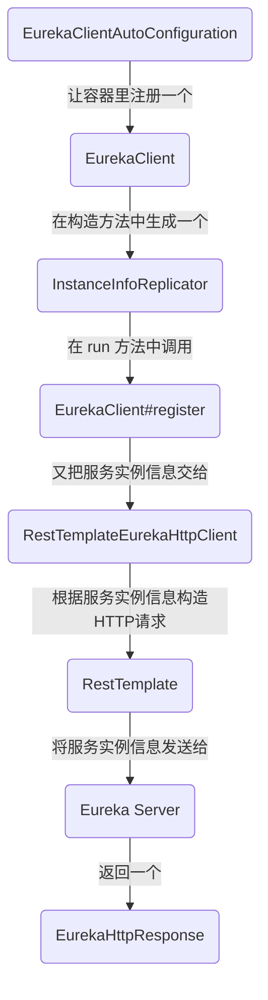
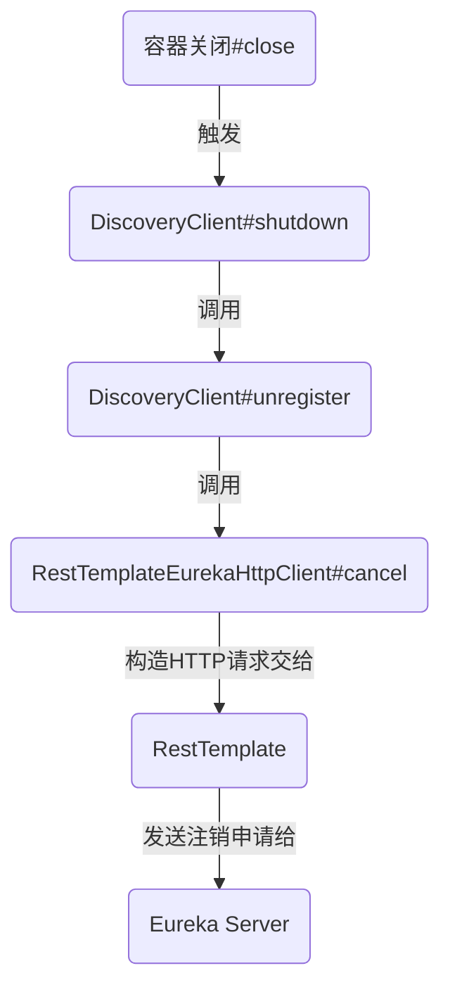
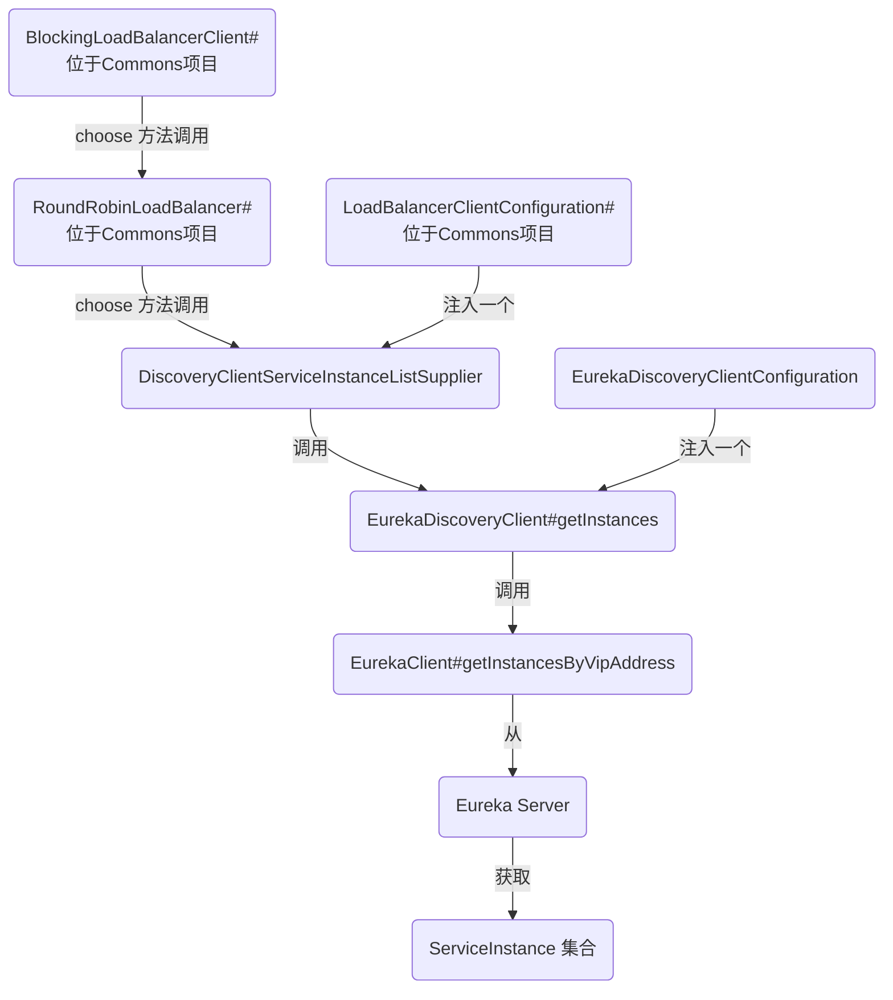
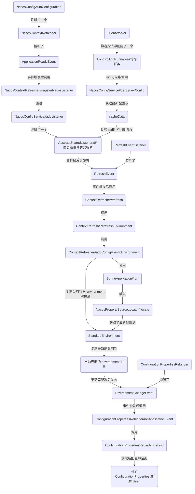

# Spring Cloud 服务注册与发现源码笔记 (Nacos/Consul/Eureka)


## Eureka

### 关键类

```bash
# 服务注册
1.EurekaClientAutoConfiguration
	注册了众多的 bean
	一部分用于和 Eureka Server 交互
	一部分和 Commons 项目对接
	注册了(EurekaClient/EurekaAutoServiceRegistration/ApplicationInfoManager/EurekaRegistration)
	   
2.EurekaClient
	与 Eureka Server 端交互
	负责向 Eureka Server 端注册/注销服务实例
	在构造方法和 shutdown 方法中根据配置处理自动注册和自动注销.

3.InstanceInfoReplicator
	负责定义一个注册或更新服务实例的任务
	负责管理任务执行器

4.RestTemplateEurekaHttpClient
	负责根据服务实例信息构造注册/注销的 Http 请求
	使用 RestTemplate 发送请求
	
5.EurekaAutoServiceRegistration
	负责管理服务实例的自动注册/注销, 与容器生命周期挂钩

6.ApplicationInfoManager
	负责管理服务实例状态变更事件(即管理监听者并在适当时机触发他们)

7.ApplicationInfoManager.StatusChangeListener
	状态改变事件监听者类
	
8.EurekaHealthCheckHandler
	服务实例状态健康检查类, 注册/注销服务实例前会调用此类进行检查其状态


# 服务发现
1.BlockingLoadBalancer (Commons 项目上)
	负责调用实际的负载均衡器去选择一个服务实例
	负责调度负载均衡整个过程, 触发相应的生命周期.
	
2.RoundRobinLoadBalancer (Commons 项目上)
	实际的负载均衡策略算法类
	负责连接 ServiceInstanceListSupplier 从其中获取服务实例列表

3.ServiceInstanceListSupplier
	定义了获取服务实例实例列表的接口(任意方式)

4.DiscoveryClient
	定义了从服务端获取服务实例列表的接口(更明确了)

4.DiscoveryClientServiceInstanceListSupplier
	ServiceInstanceListSupplier 的实现类
	连接 ReactiveDiscoveryClient 类, 将服务端获取道德服务实例列表返回出去
	
5.EurekaDiscoveryClient
	实现了 DiscoveryClient 接口
	负责调用 EurekaClient 从 Eureka Server 端获取服务实例列表.

6.EurekaClient
	与 Eureka Server 端交互
	负责向 Eureka Server 端获取服务实例列表
	在构造方法和 shutdown 方法中根据配置处理自动注册和自动注销.

7.EurekaServiceInstance
	服务实例信息对象
	实现 ServiceInstance, 与 Commons 对接

# 总结
实现了 Commons 的 DiscoveryClient 接口(即 EurekaDiscoveryClient), 于是服务发现实现了;
实现了 Commons 的 ServiceRegisty 接口(即 EurekaServiceRegistry), 于是服务注册也实现了.
再总结: Commons 大发好.
```


### 服务注册流程

```bash
# EurekaClient 构造方法触发(前提 shouldRegisterWithEureka 为 true)
1.EurekaClientAutoConfiguration 让容器里注册了一个 EurekaClient
2.EurekaClient 这个类在构造方法中的 initScheduledTasks() 生成了一个 InstanceInfoReplicator 对象
3.然后调用其 instanceInfoReplicator.start(), 逻辑是添加一个定时任务(仅执行一次), 定时任务执行 run()
4.run() 里面会执行 discoveryClient.register() 也就是注册实例信息到 Eureka 上去.
5.register() 里面会调用 RestTemplateEurekaHttpClient#register() 
6.这个方法是构造一个 HTTP 请求, 地址为 serviceUrl + "apps/" + info.getAppName(), Method 为 POST, 即 Eureka server 的ip/apps/服务实例名称(如spring.application.name), 当然请求 body 还会带上实例信息 info 对象.

# 根据容器生命周期触发
1.EurekaClientAutoConfiguration 让容器里注册了一个 EurekaAutoServiceRegistration.
2.这个类即是 SmartLifecycle(与容器生命周期绑定), 也是 SmartApplicationListener(监听容器加载/关闭事件)
3.因此其对应的 start()/stop() 和 onApplicationEvent() 都实现了对应的逻辑.
4.如 start() 的逻辑为调用 EurekaServiceRegistry#register()
5.register() 先修改本地服务实例的装填, 再通过 com.netflix.discovery.DiscoveryClient#registerHealthCheck() 来往任务管理器中提交一个任务, 后台执行, 任务 InstanceInfoReplicator#onDemandUpdate()
6.此任务就是最终也会调用前面提到的 (4) 中的 run(). 然后就注册上去了.

# PS
(6) 中的任务, 与状态监听是一致的
```

> 总结: 容器注册 EurekaClient, 调用构造方法完成大量初始化工作后, 另起一个线程调用 restTemplate 发送 HTTP 请求将当前服务实例信息发送给 Eureka server. 完成服务注册工作.





### 服务注销流程

```bash
# 容器关闭(配置了容器 shouldUnregisterOnShutdown=true)
1.在 DiscoveryClient#shutdown() 中根据 shouldUnregisterOnShutdown 判断是否需要注销
2.然后在 unregister() 中调用 RestTemplateEurekaHttpClient#cancel() 
3.cancel() 中使用 restTemplate 构造 Method 为 DELETE, URL 为 serviceUrl + "apps/" + appName + '/' + id 的请求并发送给 Eureka server 告知其注销 appName 下对应的服务实例(根据 id).

# 接收到容器关闭事件
1.EurekaClientAutoConfiguration 让容器里注册了一个 EurekaAutoServiceRegistration.
2.这个类即是 SmartLifecycle(与容器生命周期绑定), 也是 SmartApplicationListener(监听容器加载/关闭事件)
3.因此其对应的 start()/stop() 和 onApplicationEvent() 都实现了对应的逻辑.
4.如 stop() 的逻辑为调用 EurekaServiceRegistry#deregister()
5.deregister() 的作用是执行 ApplicationInfoManager#setInstanceStatus() 将状态改为 DOWN
6.因为 ApplicationInfoManager 这个类专门管理状态变化事件, 因此还会将事件发布出去. 
7.而在 initScheduledTasks 中就添加了这样的一个监听者, 起作用为调用 InstanceInfoReplicator#onDemandUpdate()
8.接着会调用 InstanceInfoReplicator#run(), 第一行代码 refreshInstanceInfo() 会确保状态为最新的(那也还是 DOWN)
9.但是其最终并不是调用 cancel 注销, 而 register 注册, 不过其中的状态是 DOWN, 因此会有 server 那边判断; 所以容器关闭事件并不会触发 cancel, 但效果应是一样的.
```

> 总结: 要么是 shutdown() 中 unregister 调用了 cancel(), 发出了 Method 为 DELETE 的请求来注销; 要么就是 EurekaClientAutoConfiguration 中与容器生命周期做关联, 全程使用 register 接口来更新状态.





### 服务发现流程

```bash
1.Spring Cloud Commons 中注册了一个 ServiceInstanceListSupplier, 具体为(DiscoveryClientServiceInstanceListSupplier)
2.这个类的作用是借助 ReactiveDiscoveryClient 的 getInstances(String serviceId) 方法向 LoadBalancer 提供从具体的 server(如Eureka) 获取服务实例对象列表, 这样只要实现 ReactiveDiscoveryClient 并放入容器就可以和 Spring cloud LoadBalancer 对接了.
3.在 EurekaDiscoveryClientConfiguration 中让容器注册了一个 DiscoveryClient(具体为 EurekaDiscoveryClient).
4.因为 Spring Cloud Commons 做了大量的预备对接工作, 所以对接其实就结束了.
5.那再简单说下 EurekaDiscoveryClient 的实现, 即注入一个 EurekaClient eurekaClient, 然后调用 DiscoveryClient#getInstancesByVipAddress() 就获取到了 ServiceInstance 列表.
```

> 总结: Commons 中准备好了对接的方式: 实现 DiscoveryClient 接口, 接着我们的确实现了 DiscoveryClient 接口, 即 EurekaDiscoveryClient, 而这这个类则会调用 EurekaClient 的 getInstancesByVipAddress 从 Eureka Server 端获取注册了的服务实例信息.




## Consul

### 关键类

```bash
# 服务注册
1.ConsulAutoServiceRegistrationAutoConfiguration
	负责添加自动注册/注销相关的 bean
	注册了 ConsulAutoServiceRegistration/ConsulAutoServiceRegistrationListener/ConsulAutoRegistration
	
2.ConsulServiceRegistryAutoConfiguration
	负责注册服务注册相关的 bean
	注册了 ConsulServiceRegistry
	
3.ConsulDiscoveryClientConfiguration
	负责注册服务发现相关的 bean
	注册了 ConsulDiscoveryClient
	
4.ConsulServiceRegistry
	负责与 ConsulClient 对接, 再提供注册/注销功能

5.ConsulClient
	与 Consul Server 端交互
	负责向 Consul Server 端注册/注销服务实例

6.AgentConsulClient
	负责根据服务实例信息构造注册/注销的 Http 请求
	
7.ConsulAutoServiceRegistration/ConsulAutoServiceRegistrationListener
	负责管理服务实例的自动注册/注销, 与容器生命周期挂钩


# 服务发现
1.BlockingLoadBalancer (Commons 项目上)
	负责调用实际的负载均衡器去选择一个服务实例
	负责调度负载均衡整个过程, 触发相应的生命周期.
	
2.RoundRobinLoadBalancer (Commons 项目上)
	实际的负载均衡策略算法类
	负责连接 ServiceInstanceListSupplier 从其中获取服务实例列表

3.ServiceInstanceListSupplier
	定义了获取服务实例实例列表的接口(任意方式)

4.DiscoveryClient
	定义了从服务端获取服务实例列表的接口(更明确了)

4.DiscoveryClientServiceInstanceListSupplier
	ServiceInstanceListSupplier 的实现类
	连接 ReactiveDiscoveryClient 类, 将服务端获取道德服务实例列表返回出去
	
5.ConsulDiscoveryClient
	实现了 DiscoveryClient 接口
	负责调用 ConsulClient 从 Consul Server 端获取服务实例列表.

6.ConsulClient
	与 Consul Server 端交互
	负责向 Consul Server 端获取服务实例列表

7.ConsulServiceInstance
	服务实例信息对象
	实现 ServiceInstance, 与 Commons 对接

# 总结
实现了 Commons 的 DiscoveryClient 接口(即 ConsulDiscoveryClient), 于是服务发现实现了;
实现了 Commons 的 ServiceRegisty 接口(即 ConsulServiceRegistry), 于是服务注册也实现了.
再总结: Commons 大发好.
```

### 服务注册流程

```bash
1.ConsulAutoServiceRegistration 调用 org.springframework.cloud.consul.serviceregistry.ConsulServiceRegistry#register() 完成注册
2.接着 register() 调用 ConsulClient#agentServiceRegister()
3.然后会调用 AgentConsulClient#agentServiceRegister()
4.生成并发送请求, 请求地址为 /v1/agent/service/register

```

> 总结: 其实和 Eureka 差不多, 只是我跳过了一点点细节. 基本是就是 与 ServiceRegistry 交互了, 非常的配合 Commons 项目, 就像一个人写的一样...


### 服务发现流程

```bash
1.首先是 DiscoveryClientServiceInstanceListSupplier 会调用 ConsulDiscoveryClient#getInstances()
2.接着 getInstances() 会调用 ConsulClient#getHealthServices()
3.然后就是发送 HTTP 请求了, 请求地址为 /v1/health/service/, 返回的对象封装处理下得到 ServiceInstance 的实现类 ConsulServiceInstance.
```

> 总结: 这次真的是和 Eureka 类似, 从 Commons 到 ConsulDiscoveryClient, 流程是一样的. 而其实 ConsulDiscoveryClient 的逻辑也和 EurekaDiscoverClient 类似... 只能说其实服务注册发现这个框架, 我们关注的功能其实并不是难点. 难点是 server 端的管理.


## Nacos

### 关键类

```bash
# 服务注册
1.NacosServiceRegistryAutoConfiguration
	负责添加自动注册/注销相关的 bean
	注册了 NacosAutoServiceRegistration/NacosServiceRegistry/NacosRegistration
	
2.NacosDiscoveryClientConfiguration
	负责注册服务发现相关的 bean
	注册了 NacosDiscoveryClient
	
3.NacosServiceRegistry
	负责与 NamingService 对接, 再提供注册/注销功能

4.NamingService
	与 Nacos Server 端交互
	负责向 Nacos Server 端注册/注销服务实例
	调用 NamingProxy

5.NamingProxy
	负责根据服务实例信息构造注册/注销的 Http 请求
	
6.NacosAutoServiceRegistration
	负责管理服务实例的自动注册/注销, 与容器生命周期挂钩

7.NacosRegistration
	本地实例对象, 相比服务实例数据更多


# 服务发现
1.BlockingLoadBalancer (Commons 项目上)
	负责调用实际的负载均衡器去选择一个服务实例
	负责调度负载均衡整个过程, 触发相应的生命周期.
	
2.RoundRobinLoadBalancer (Commons 项目上)
	实际的负载均衡策略算法类
	负责连接 ServiceInstanceListSupplier 从其中获取服务实例列表

3.ServiceInstanceListSupplier
	定义了获取服务实例实例列表的接口(任意方式)

4.DiscoveryClient
	定义了从服务端获取服务实例列表的接口(更明确了)

4.DiscoveryClientServiceInstanceListSupplier
	ServiceInstanceListSupplier 的实现类
	连接 ReactiveDiscoveryClient 类, 将服务端获取道德服务实例列表返回出去
	
5.NacosDiscoveryClient
	实现了 DiscoveryClient 接口
	负责调用 NamingService 从 Nacos Server 端获取服务实例列表.

6.NamingService
	与 Nacos Server 端交互
	负责向 Nacos Server 端获取服务实例列表

7.NacosServiceInstance
	服务实例信息对象
	实现 ServiceInstance, 与 Commons 对接

# 总结
实现了 Commons 的 DiscoveryClient 接口(即 NacosDiscoveryClient), 于是服务发现实现了;
实现了 Commons 的 ServiceRegisty 接口(即 ConsulServiceRegistry), 于是服务注册也实现了.
再总结: Commons 大发好.
```


### 服务注册流程

```bash
1.NacosAutoServiceRegistration 调用 NacosServiceRegistry#register 完成注册
2.接着 register() 调用 NacosNamingService#registerInstance()
3.然后会调用 NamingProxy#registerService()
4.生成并发送请求, 请求地址为 /nacos/v1/ns/instance

```

> 总结: 这和 Consul 差不多; 还是继承 AbstractAutoServiceRegistration 来与 ServiceRegistry 交互了, 也是非常的配合 Commons 项目啊!!


### 服务发现流程

```bash
1.首先是 DiscoveryClientServiceInstanceListSupplier 会调用 NacosDiscoveryClient#getInstances()
2.接着 getInstances() 会调用 NacosServiceDiscovery#getInstances()
3.然后就是发送 HTTP 请求了, 请求地址为 /nacos/v1/ns/instance/list, 返回的对象封装处理下得到 ServiceInstance 的实现类 NacosServiceInstance.
```

> 总结: 依然是和 Eureka/Consul 类似, 从 Commons 到 NacosDiscoveryClient, 流程是一样的. 而其实 NacosDiscoveryClient 的逻辑也和 ConsulDiscoveryClient/EurekaDiscoverClient 类似, 最终总是发起 HTTP 查询 server 端, 所以 server 端的代码才比较有趣啊.


## Nacos Config


### Nacos Config Client 加载 nacos server 配置原理


#### 关键类

```bash
1.NacosConfigBootstrapConfiguration
	注册了一个 NacosPropertySourceLocator

2.NacosPropertySourceLocator
	用于从 nacos server 上加载 dataId 对应的配置文件到 environment 的 PropertySource 集合中.
	
3.ConfigService
	用于与 nacos server 通信, 获取配置文件, 乃至订阅更新
	
4.NacosPropertySourceBuilder
	借助 ConfigService 与 NacosDataParserHandler 从 nacos 获取 NacosPropertySource
	
5.NacosDataParserHandler
	用于序列化(转码)服务端的配置文件数据为一个 PropertySource(即 NacosPropertySource)


# 自动刷新
1.NacosConfigAutoConfiguration
2.NacosContextRefresher
	

```

> 总结: ConfigService 与 NacosDataParserHandler 是两个干事的, 其他都是渣渣!!!


#### 从 server 获取配置流程

```bash
1.在 NacosConfigBootstrapConfiguration 中注册了一个 PropertySourceLocator(即 NacosPropertySourceLocator), 可用于为 environment 添加 PropertySource
2.然后实现 locate 方法, 即 NacosPropertySourceLocator#locate()
3.在 locate() 的最后面, 调用了 loadApplicationConfiguration()
4.这个方法通过多次调用 loadNacosDataIfPresent() 加载 dataId 和不同文件后缀以及profile 组和得到不同的 dataId.
5.loadNacosDataIfPresent() 调用了 loadNacosPropertySource()
6.其最终调用了 NacosPropertySourceBuilder#loadNacosData()
7.loadNacosData() 调用 ConfigService#getConfig() 
8.getConfig() 会使用 ClientWorker#getServerConfig() 发起 HTTP 请求从 nacos server 获取配置文件. 其请求地址是 /v1/cs/configs
```

>  还是挺简单的, 发个 HTTP 获取配置文件, 然后转化成一个 PropertySource, 再在 NacosPropertySourceLocator 的 locate 中扔进 environment 中去. Bingo!!!


#### 从 server 实时更新原理

```bash
1.在 NacosConfigAutoConfiguration 注册了一个 NacosContextRefresher
2.其实现了 ApplicationListener<ApplicationReadyEvent>, 也就是会在容器准备事件触发后调用 NacosContextRefresher#registerNacosListenersForApplications()
3.在进行两个配置判断后(即 isRefreshEnabled() 和 PropertySource 的 isRefreshable), 调用 NacosContextRefresher#registerNacosListener() 
4.这个方法通过 NacosConfigService#addListener() 注册一个 AbstractSharedListener 监听者到 cacheData.
5.而 ClientWorker#checkConfigInfo() 中添加的 LongPollingRunnable 任务, 会在 run() 中执行 getServerConfig() 获取服务配置文件, 然后与当前缓存对比 md5, 若更新则通过 cacheData 取出刚刚添加的 listener, 触发事件(即 receiveConfigInfo() )
6.触发后又会再发布一个 RefreshEvent 事件
7.接着流转到 RefreshEventListener.onApplicationEvent()
8.然后又会调用 ContextRefresher.refresh(), 这个方法中的 refreshEnvironment() 会调用 addConfigFilesToEnvironment(), 这方法先复制一个 StandardEnvironment, 将其放入到 SpringApplication 中, 再调用 SpringApplication 的 run() 走一遍, 会触发 NacosPropertySourceLocator.locate(), 于是复制的 environment 里面有新数据了, 再将其拷贝替换到当前的 environment. 完成 environment 的刷新. 
9.接着发布一个 EnvironmentChangeEvent 事件, 用来刷新 @ConfigurationProperties 注解的 Bean. (这么喜欢事件?不愧是写出 RocketMQ 的阿里啊!!!)
10.接着在 ConfigurationPropertiesRebinder 中接收到这个事件, 触发 onApplicationEvent()
11.然后会执行 ConfigurationPropertiesRebinder#rebind()
12.其逻辑是将 postProcessBeforeInitialization 中存起来的 ConfigurationPropertiesBean 类型的 map 遍历, 进行重新绑定(即 destroyBean 后再 initializeBean, 则会从新配置重新赋值). 
```

> 总结: 有的地方(NacosContextRefresher)监听容器初始化添加配置更新的监听者, 自己不干活只发布配置刷新事件;
>
> 有的地方(ClientWorker)添加轮询任务获取服务端配置文件与本地 cacheData 对比 md5 来判断是否触发配置更新的监听者;
>
> 然后有的地方(RefreshEventListener)监听配置刷新事件然后用 SpringApplication.run() 通过触发 NacosPropertySourceLocator#locate() 为一个复制出来的 environment 对象添加从服务端获取最新配置, 再拷贝到当前的 environment 对象, 完成 environment 配置的刷新, 之后发布 environment 刷新事件;
>
> 有的地方(ConfigurationPropertiesRebinder)监听 environment 刷新事件, 然后为 @ConfigurationProperties 注解生成的 bean 重新绑定配置.
>
> 再总结: 挺好的, 奥运火炬手啊这是, 不停传递!!!!!


#### 关键类

```bash
1.NacosConfigAutoConfiguration
	注册一个监听容器初始化事件的 bean (NacosContextRefresher)

2.NacosContextRefresher
	再初始化事件触发后添加一个 AbstractSharedListener 监听者到 cacheData

3.AbstractSharedListener
	当服务端配置与本地不同后触发
	触发后发布 RefreshEvent 事件

4.CacheData
	管理配置更新事件监听者
	对比服务端配置与本地配置的 md5
	md5 不同则触发 AbstractSharedListener
	
5.RefreshEvent
	通过容器发布
	当服务端配置发送更新触发
	触发后调用 ContextRefresher#refresh()
	
6.LongPollingRunnable
	轮询任务, 获取服务端最新配置, 与 cacheData 对比

7.ClientWorker
	管理轮询任务(LongPollingRunnable)
	负责与 nacos 服务端通信
	
8.ContextRefresher
	监听 RefreshEvent 事件
	负责获取服务端最新配置到 environment 对象中
	发布 EnvironmentChangeEvent 事件
	
9.EnvironmentChangeEvent
	通过容器发布
	当 environment 对象更新后触发
	触发后调用 ConfigurationPropertiesRebinder#rebind()
	
10.ConfigurationPropertiesRebinder
	监听 EnvironmentChangeEvent 事件
	负责重新绑定用了 @ConfigurationProperties 注解的 Bean 的值

```





